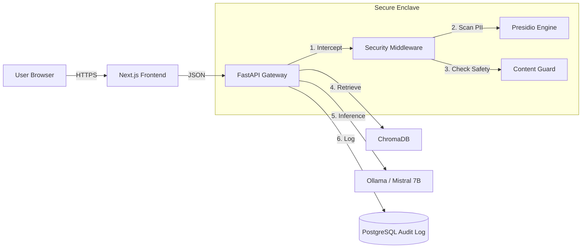

# 🏗️ System Architecture

## High-Level Data Flow

## Key Components

### 1. The Gateway (FastAPI)
The central nervous system. It handles:
- **Authentication**: JWT validation via `auth/security.py`.
- **Rate Limiting**: Token bucket algorithm via `SlowAPI`.
- **Orchestration**: Manages the flow between Security, RAG, and LLM services.

### 2. The Memory (RAG Pipeline)
Located in `services/rag.py`.
- **Ingestion**: pdf -> text -> chunks (512 tokens) -> embeddings.
- **Retrieval**: Semantic search using Cosine Similarity.
- **Storage**: ChromaDB (persistent local vector store).

### 3. The Audit Chain (Immutable Logs)
Located in `services/audit.py`.
- Every request is hashed (`SHA-256`) and signed (`HMAC`).
- Logs are stored in PostgreSQL with a unique constraint on the hash.
- This creates a tamper-evident chain of custody for compliance.
